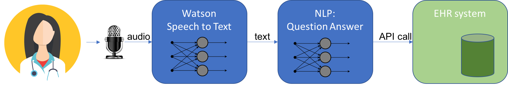

# Deep Learning for Electronic Health Record

When we go to the doctor's office for a visit, most of us are familiar with the sight of our doctor coming into the exam room with our paper chart:  this is our medical record in the form of a folder containing lab result, notes, etc, from previous visits.  The paper chart has been an essential part of the medical service for years.  A typical doctor office would have a back room with rows of filing cabinets filled with patient paper charts.  The medical assistants would be busy pulling the charts to prepare for a patient, adding new notes after the visit, and filing it back in the cabinets.   

Although computers have also been around for decades, the paper chart continues to be an enduring fixture in the doctor office, resisting computerization for several reasons.  First, the vast amount of legacy information in paper proves challenging to digitize;  simply scanning the paper notes does not really help because the data cannot be easily organized and discovered. Second, and more difficult to solve, is the customization of doctor's notes:  because the notes are created and used by individual doctors, over the years they become highly customized to fit the workflow, practice and specialty of the doctors.  The doctors essentially develop their own personal system of coding the necessary information in the notes.  This customization allows the doctors to be highly efficient in writing and reading his/her notes, but it is difficult to convert to a standardized form.  

In recent years, the Affordable Care Act (ACA) has been a major catalyst in pushing the practice in medicine toward the age of computers.  ACA provides financial incentives as well as penalties to encourage medical offices to migrate from paper charts to Electronic Health Record (EHR). As a result, companies providing EHR software have been proliferating, offering solution ranging from subscription-based web service to full in-house installation.  Evaluating and choosing an EHR solution can be an exasperating exercise for a doctor, however, a bigger challenge comes when the doctor uses the software in real practice.   

I have had the opportunity to help several doctors train to use different EHR systems, and the experience was an eye opening exercise in bringing IT to a non IT audience. In one particular case, after a week of intensive EHR training to enter diagnosis, order lab tests, vaccines, prescription, etc, two doctors made a decision: instead of using the software themselves, they will dictate the record of the patient visit and have the dictation entered into the system by a person familiar with the software. In fact, it is not uncommon for a doctor to hire a medical assistant to shadow the patient visit, listen in on the conversation and enter the information into the system.  Although expensive, this practice does free up the doctor to focus on providing care for the patient. 

Reflecting on the doctors' choices, one can easily spot the problem. As in the screenshot below, the typical user interface found in all the EHR software consists of the usual screen filled with menus, pop-up dialog, drop-down list to select, box to check, etc. For developers and digital workers, this interface is familiar, but it  does not work well for the doctors for many reasons. There are too many options, the navigation is not intuitive, the UX design cannot be fully customized to fit the doctor’s workflow, etc. In many cases, EHR software can actually slows down the doctor during the critical time of the patient visit, making the doctor less productive, not more.  When the doctor brings along a laptop to the exam room and continually shifts attention to the EHR data entry, the form factor can also have a negative impact on the patient's experience.  

In this regard, the existing EHR user interface simply is not a good fit for the doctor/patient environment.  The solution that some are adopting is basically to circumvent the user interface altogether by substituting a human to perform as the interface. In fact, this need has given rise to new companies providing the human transcription service for EHR, but this ad hoc solution cannot be a very satisfying answer for the EHR industry.

Can the computer interface be improved so that the users would not feel compelled to circumvent it?  Advanced EHR systems do allow varying degree of customization and short cut to help alleviate the problem.  One technique is to create templates for common patterns.  For example, a child typically comes to the pediatric clinic either because of illness or for a routine check up. In this case, two different templates can be created that would contain different flows for data entries to make the interface more intuitive and productive.    

However, there is a potential alternative worth considering. Recent advances in AI and Deep Learning have enabled pragmatic uses of AI in day-to-day tasks. We all can just pick up our smart phone, say “Hey Siri” or “Okay Google”, and ask a question. We can also open a browser on the smartphone and search for the same question, but the voice interface can be much more natural and convenient. Similarly, smart home products such as Amazon's Alexa, Google Home now are stationed in many household, constantly listening in on the conversation.  So for our problem with finding a good EHR interface, it does not take much imagination to envision a computer listening in on a doctor/patient conversation and parsing the information to fill in the EHR entries automatically, freeing the doctor to focus on providing care. In other words, a computerized live transcription service for doctors now appears feasible.

What would it take to build such an AI-enabled EHR software? Let's look at the potential building blocks as illustrated in the following diagram.  

Speech to text processing is now reasonably usable for common speech.  The doctor conversation or dictation can be captured by a laptop or a device similar to Google Home, and the audio would be sent live to a Cloud service such as the [Watson Speech to Text service](https://www.ibm.com/watson/services/speech-to-text/).  The service, most likely running an internal Deep Learning model, would return the converted text.  For improved recognition of medical terminology, it would be advantageous to retrain the model with the appropriate voice data set.  The next task is to parse information from the text to extract the relevant data and send API calls to the EHR system to fill the medical record.  New research in Natural Language Processing such as [Question Answer](https://github.com/allenai/allennlp) can provide a solution. [IBM Watson Natural Language Understanding](https://www.ibm.com/cloud/watson-natural-language-understanding) provide some service in this space, although it does not currently handle medical data yet.  At least one well-funded AI start-up, [SayKara](http://www.saykara.com), is already working on a full solution for medical scribe.

One point worth noting is that result from Deep Learning model is never guaranteed to be 100% correct.  For a computerized transcription service, this means that the data entered into the EHR is not guaranteed to be 100% correct, and the doctor will have to review and validate the records before signing off. However, human transcription is not guaranteed to be correct either and doctors have always reviewed and signed off the record. With active learning, the validated entries can be used to retrain the model and improve future transcription.

How valuable would such an AI enhancement be for doctors? No scientific study has been done yet, but the estimated time saving per patient I have heard is in the range of 20% to 30%, a significant amount.  The doctors can use this time to serve more patients, improving their productivity, or to spend more time with each patient, improving the quality of care.  Deep learning can be leveraged in many medical applications, but even in the mundane task of entering medical record, it can deliver a major impact.
			

